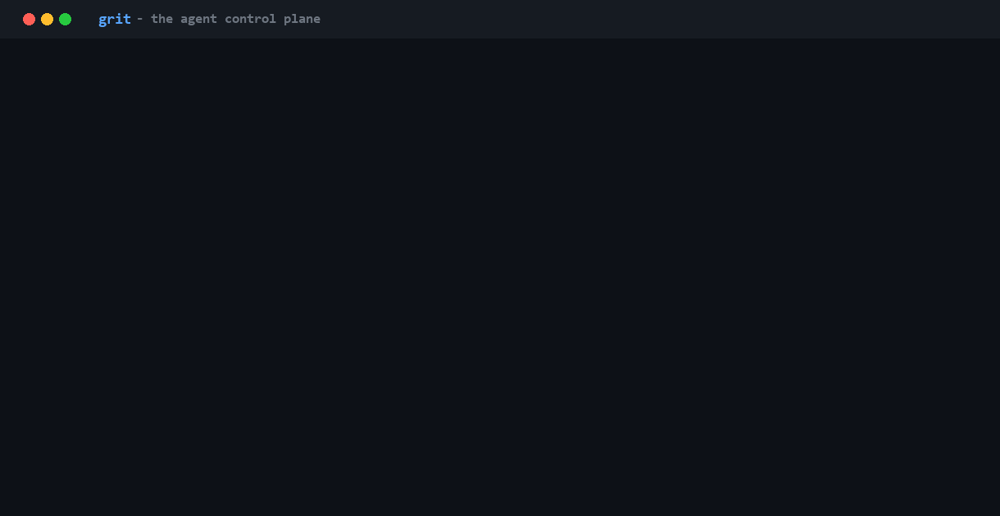

# GRIT

**Autonomy for your agents. A seatbelt for you.**

Every tool call your AI agent makes goes through GRIT first — allowed,
blocked, or held for a human. Everything is recorded; any session can be
replayed. One process in the call path, minutes to install, no changes to
your agent or your tools.




That fixes the things that actually stop you from shipping agents: you can't
see what the agent did, you can't reproduce what went wrong, you can't stop
it when it goes sideways, and you can't prove any of it to a reviewer.

Think **Stripe Radar for AI agent actions** — static rules catch what you
predicted; the risk engine catches what you didn't; the flight recorder lets
you replay the whole thing tomorrow, offline, for free.

Zero dependencies (Python 3.10+ stdlib). Works with any MCP host (Claude
Desktop, Claude Code, custom agents) and any stdio MCP server — no changes to
either side.

```
agent (Claude / GPT / custom)
        │  one MCP connection
        ▼
   ┌──────────────┐  KILL SWITCH: one button refuses every call from the next one on
   │    GRIT    │  policy engine (allow / deny / approve, rate limits)
   │   control    │  RISK ENGINE: behavioral baselines, anomaly, bursts,
   │    plane     │    stuck loops, secrets-in-args — learns from every call
   │              │  SESSION BUDGET: runaway loops stop costing money
   │              │  FLOW GUARD: a secret read from a private source and
   │              │    headed to an external sink is held — the lethal
   │              │    trifecta enforced structurally, not filtered
   │              │  human-in-the-loop approvals (CLI + web dashboard)
   │              │  FLIGHT RECORDER: every call recorded -> deterministic
   │              │    replay, per-session cost meter, drift canary
   │              │  tamper-evident audit (sha256 hash chain) + export
   └──────────────┘  PII / secret redaction of tool results
        │  fan-out
        ▼
  your MCP servers (github, payments, files, …)
```

## The pains this kills

| You today | With GRIT |
|---|---|
| "It failed, I reran it, it worked" | `grit replay <session>` — re-run against recorded tool results: deterministic, offline, $0 |
| "The agent burned $400 overnight in a loop" | session budgets + velocity-burst & stuck-loop detection + per-tool cost meter |
| "I can't stop it once it's running" | `grit pause` — a Kill Switch *in the call path*: it can refuse calls, not just display them |
| "I don't know what it actually did" | full flight trace per session: every call, decision, latency, failure class |
| "I'm afraid to give it prod tools" | default-deny policies, human approval for the scary calls, risk scoring for the unpredicted ones |
| "Security review / audit is blocking launch" | hash-chained audit log + `grit export` evidence packet (SOC 2, customer security questionnaires) |
| "A poisoned issue/email could make the agent leak our keys" | flow guard: verbatim secrets from private sources are stopped at external sinks (the GitHub-MCP / Supabase-MCP exfil pattern) |
| "I'm scared to tighten policy — what if I break legit workflows?" | `grit backtest new-policy.json` — test any policy against your real recorded history *before* enforcing it |
| "Run #2 behaved differently than run #1 and I don't know where" | `grit diff <a> <b>` — the exact step two sessions parted ways, agent's choice vs. world's change |

## Quickstart (2 minutes)

```bash
cd grit
python3 -m grit.cli init     # writes grit.json + policies.json
python3 examples/demo.py       # live demo: policies, risk, flow guard, budget, kill switch, replay
python3 -m pytest -q           # 156 tests incl. end-to-end over real stdio
```

(`python` on Windows.) Plug into Claude Desktop / any MCP host — one entry
replaces all your servers:

```json
{
  "mcpServers": {
    "grit": {
      "command": "python3",
      "args": ["-m", "grit.cli", "serve", "--config", "/path/to/grit.json"]
    }
  }
}
```

Your real servers go into `grit.json` → `upstreams`; tools appear to the
agent as `<server>__<tool>`.

## Start in observe mode (nothing blocked, everything learned)

Already have agents running live? Don't start by blocking them — start by
watching them:

```json
"mode": "observe"
```

Every decision is still computed and logged — policy verdicts, risk scores,
budget breaches — but nothing is blocked (the kill switch and schema
validation still work). Calls that *would* have been held or denied land in
the audit log as `executed_shadow` with the rule that would have fired. After
a week, `grit log` answers the only question that matters: **"what would
GRIT have stopped?"** Flip to `"mode": "enforce"` when the answer convinces
you. Same monitor-then-enforce path every WAF and EDR adoption follows.

## The Risk Engine (what policies can't do)

Every call is scored 0–100 with named, explainable factors:

| Signal | Example factor |
|---|---|
| Numeric anomaly vs. history | `'amount'=49 deviates from baseline (median 13, z=24.0, n=6)` |
| Novelty | `first ever call of this tool` |
| Velocity burst | `velocity burst: 12 calls in 60s` (runaway loops) |
| Stuck loop | `identical call already executed 3 times in a row` |
| Secrets in arguments | `arguments contain secret/PII-looking data` (exfiltration) |
| Sensitive targets | `/etc/`, `.env`, `prod`, `rm -rf`, `DROP TABLE` |
| Destructive/mutating verbs | `delete`, `transfer`, `deploy`, … |

Baselines warm-start from your audit history and learn from every executed
call (blocked calls don't poison them). Risk escalates calls that static
policy would have allowed:

```json
"risk": {"enabled": true, "approve_at": 50, "deny_at": 85}
```

Classic catch: your policy requires approval for transfers over $50, the
agent learns to send $49. Static rules pass it. GRIT's Risk Engine flags
the anomaly and holds the call. Every human approve/deny becomes labeled
training data — **your deployment** gets smarter the more you use it
(baselines are local; nothing leaves your machine).

## The Flow Guard (the lethal trifecta, enforced)

Prompt-injection *filters* are bypassed at 60–80% rates in published tests;
the only defense the security community calls robust is limiting what a
compromised agent can **do**. The trifecta that makes an agent exploitable:
access to private data + exposure to untrusted content + an external channel.
GRIT enforces it structurally. Declare trust zones per upstream:

```json
"upstreams": [
  {"name": "db",   "command": "...", "trust": ["private_source"]},
  {"name": "web",  "command": "...", "trust": ["untrusted_source"]},
  {"name": "mail", "command": "...", "trust": ["external_sink"]}
],
"flow": {"action": "approve"}
```

From then on: any **verbatim secret** (API key, AWS key, card number, SSN)
that entered the session from a `private_source` result and shows up in the
arguments of an `external_sink` call gets held for a human (or denied with
`"action": "deny"`) — with a reason that names the source, masks the secret,
and flags when the session also ingested untrusted content ("lethal trifecta
complete"). This is exactly the call-path shape of the public GitHub-MCP and
Supabase-MCP exfiltration incidents.

Deliberately narrow (see limitations): verbatim entities only — a paraphrased
API key stops being an API key. When this fires, it's worth your attention.

## Policy Wind Tunnel & session diff

Test a policy change against **your own recorded history** before it touches
production — the false-positive fear that keeps teams in observe mode dies
with data:

```bash
grit backtest candidate-policies.json
# example: backtest 14310 recorded calls vs candidate-policies.json
#   new policy verdicts: 14290 allow, 18 approve, 2 deny
#   changes vs history: 2 executed calls would now be DENIED; ...
grit backtest candidate-policies.json --max-blocked 0   # CI gate: exit 2
```

And when two runs of the same task behave differently, stop guessing:

```bash
grit diff s-20260612-a s-20260612-b
# DIVERGED at step 4: same tool pay__transfer_money, different arguments
#   (exit 0 identical / 3 diverged — wire it into regression CI)
```

`diff` separates *the agent chose differently* (different call) from *the
world changed* (same call, different outcome) — the first question of every
agent postmortem, answered in one command.

## Flight Recorder & deterministic replay

Every call (arguments, redacted result, status, latency, failure class,
token estimate) is recorded per session:

```bash
grit sessions                # list recorded agent runs
grit trace <session>         # the full timeline: what happened, step by step
grit costs [--session s]     # which tools eat your context window (and $)
grit replay <session>        # serve recorded responses as a mock MCP server
grit replay <session> --strict   # any divergence from the recording = error
grit diff <a> <b>            # where two runs parted ways (exit 0/3)
grit incident-card <session> # shareable HTML card of the one caught call + replay (--json = open format)
grit backtest new-rules.json # what would this policy have done to history?
```

Replay makes the worst agent bug — "it failed, I reran it, it worked" —
debuggable: re-run the agent against yesterday's recorded tool results. No
live tools touched, no side effects, no API spend, and divergences (the agent
deciding differently) are flagged at the exact step they happen.

## Runaway protection

```json
"budget": {"max_calls_per_session": 500,
           "max_tokens_per_session": 2000000, "action": "approve"}
```

When a session exceeds its budget, further calls are held for a human
(`approve`) or refused (`deny`). Combined with per-rule rate limits, the
velocity-burst and stuck-loop risk factors, this is the difference between a
$4 incident and a five-figure one (runaway agent loops producing five-figure
cloud bills are public, documented incidents).

And when something is going wrong **right now**:

```bash
grit pause       # the kill switch: every call refused, agents told to stop
grit resume      # lift it
```

The dashboard has the same button. Pause state lives in the shared DB — any
terminal, any process, takes effect on the very next call.

## Policies

`policies.json` — ordered rules, first match wins, default deny:

```json
{
  "default_action": "deny",
  "rules": [
    {"id": "no-destructive", "tools": ["*delete*", "*drop*"], "action": "deny",
     "reason": "destructive operations are forbidden"},
    {"id": "block-large", "tools": ["pay__transfer_money"],
     "where": [{"path": "amount", "gt": 1000}], "action": "deny"},
    {"id": "approve-mid", "tools": ["pay__transfer_money"],
     "where": [{"path": "amount", "gt": 50}], "action": "approve"},
    {"id": "internal-mail", "tools": ["mail__send_email"],
     "where": [{"path": "to", "not_regex": "@company\\.com$"}], "action": "deny"},
    {"id": "search", "tools": ["docs__search"], "action": "allow",
     "rate_limit": {"max_calls": 5, "window_seconds": 60}},
    {"id": "rest", "tools": ["*"], "action": "allow"}
  ]
}
```

Matchers: `regex`, `not_regex`, `eq`, `gt`, `gte`, `lt`, `lte`, `max_len`;
dot-paths into arguments. Actions: `allow` · `deny` · `approve` (hold for a
human). Malformed / hallucinated calls are rejected against the tool's schema
before they reach a live system, with a fix-it message back to the agent.

## Ops, audit, evidence

```bash
grit dashboard      # the control room (screenshot-worthy): hero metrics,
                      #   24h activity sparkline, kill switch, one-click
                      #   approvals, flight-recorder sessions with expandable
                      #   call timelines, cost meter, failure taxonomy
grit pending        # calls waiting for a human (with risk scores)
grit approve 3      # release call #3   (deny 3 to refuse)
grit stats          # per-tool: calls, blocked, errors, latency, risk
grit log -n 50      # recent decisions with risk scores
grit watch          # live tail of decisions, colored (Ctrl+C to stop)
grit check pay__transfer_money --args '{"amount": 49}'
                      # dry-run policy + risk for a call WITHOUT executing it:
                      #   exit 0 allow / 3 approve / 2 deny — wire it into CI
grit incident <session> --out report.md
                      # one-command Markdown postmortem: timeline, failures,
                      #   costs, audit-chain verdict
grit failures       # failure taxonomy: schema_mismatch / policy_block / risk_block / ...
grit drift          # last 24h vs previous: failure rate, latency, risk, volume shifts
grit verify         # sha256 hash chain: exit 0 intact, 2 tampered
grit export --out evidence.jsonl   # auditor/incident packet: chain status + audit + recordings
```

Every decision is appended to a hash-chained SQLite log; editing, inserting
or deleting any historical record breaks the chain. `export` produces the
evidence packet you hand to a SOC 2 auditor or a security reviewer — or attach to an
incident review.

When a call is held for approval, GRIT can ping your team where they
already live — any Slack-compatible incoming webhook:

```json
"approval": {"timeout_seconds": 300,
             "notify_url": "https://hooks.slack.com/services/T000/B000/XXXX"}
```

The message carries the tool, arguments, risk score, the reason it was held,
and the exact `grit approve <id>` command. Fire-and-forget: an unreachable
webhook never delays or breaks the call path.

## Layout

```
grit/
  jsonrpc.py    # MCP stdio framing (newline-delimited JSON-RPC 2.0)
  upstream.py   # upstream MCP server subprocess management
  policy.py     # first-match policy engine + rate limits
  risk.py       # risk engine: baselines, anomalies, bursts, stuck loops, novelty
  audit.py      # hash-chained audit + approvals + controls + drift (SQLite, WAL)
  recorder.py   # flight recorder + deterministic replay + cost meter
  incident.py   # shareable incident-replay artifact (one caught call -> HTML + open format)
  flow.py       # flow guard: trust zones + verbatim-secret egress control
  backtest.py   # policy wind tunnel: candidate rules vs recorded history
  sessdiff.py   # behavioral diff between two recorded sessions
  redact.py     # PII/secret redaction
  gateway.py    # the control plane (kill switch -> schema -> policy -> risk
                #   -> budget -> approval -> execute -> redact -> audit)
  cli.py        # serve/init/pause/resume/pending/approve/deny/log/stats/
                #   sessions/trace/replay/costs/drift/failures/verify/export/dashboard
  dashboard.py  # local web dashboard (stdlib http.server)
examples/       # demo MCP server + live end-to-end demo
tests/          # 156 tests incl. e2e over real subprocesses
```

## MVP limitations (honest list)

- stdio upstreams only (HTTP/SSE transports — next).
- Proxies `tools/*` only; resources/prompts pass-through not yet implemented.
- Sequential request handling; approval holds block the session (fine for
  single-agent use).
- Token/cost numbers are estimates (~4 chars/token), not provider-billed
  truth.
- Risk engine is heuristic + statistical (per-deployment); the
  cross-deployment Risk Network and ML scoring are the hosted layer, not in
  OSS.
- Flow guard is **verbatim-entity level by design**: it catches secrets, key
  material and card/SSN patterns copied into outgoing arguments; it does NOT
  detect paraphrased/semantic leaks (nothing reliably does), and its secret
  set lives in process memory for the gateway's lifetime only.
- `backtest` replays static policy rules (incl. historical rate-limit
  windows); it does not re-run the risk engine or flow guard, whose verdicts
  depend on live session state.
- Dashboard binds to localhost, no auth — do not expose it.

MIT license.
